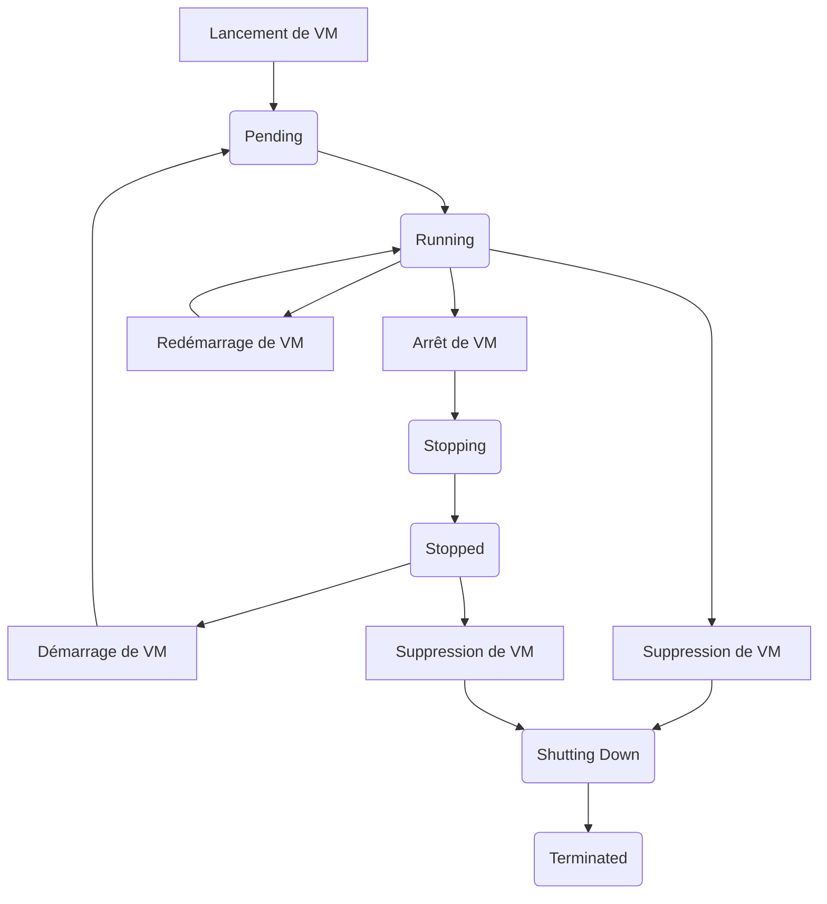

# Cycle de vie d'une VM

Une [VM (Virtual Machine)](/docs/compute/concept/) passe par différents états entre le moment où vous la lancez et le moment où vous la terminez. Vous pouvez gérer leur cycle de vie, ce qui entraîne des conséquences sur les ressources qui lui sont allouées ou attachées.

L'illustration suivante représente les transitions entre les états d'une VM :



## Création

Créer une VM correspond à la fois à la créer puis à la démarrer. Une fois la VM créée, elle est à l'état "pending" jusqu'à ce qu'elle soit créée, démarrée et prête à l'usage. L'état de la VM passe alors à "running".

Le fait de créer une VM lui alloue les ressources matérielles correspondantes. Vous définissez la configuration matérielle du serveur qui l'héberge grâce à un type de VM, puis le système d'exploitation, sa configuration et possiblement des applications logicielles grâce à une Image.

La VM reçoit un ID unique, ainsi qu'une IP (Internet Protocol) privée et un nom DNS (Domain Name System) privé associé.

> Pour attribuer une adresse IP publique à une VM d'un [VPC (Virtual Private Cloud)](/docs/network/vpc/concepts/), vous pouvez lui attacher une IP publique.

Vous pouvez également attacher des NIC (Network Interface Card) à une VM lors de sa création ou ultérieurement pour fragmenter son réseau.

## Arrêt et démarrage

Vous pouvez arrêter une VM en cours de fonctionnement ("running") à tout moment, puis la démarrer à nouveau. Arrêter une VM avec l'API correspond à la couper avec la commande du système d'exploitation.

Vous pouvez également forcer l'arrêt d'une VM. Cette action arrête la VM sans quitter proprement les applications en cours d'utilisation.

:::warning
Forcer l'arrêt d'une VM peut endommager le système et corrompre les données.
:::

Lorsque vous arrêtez une VM, celle-ci passe à l'état "stopping", puis à l'état "stopped". Lorsque vous démarrez une VM arrêtée, celle-ci est à l'état "pending", puis passe ensuite à l'état "running".

Lors de l'arrêt et du démarrage de la VM, celle-ci conserve :

- Son ID ;
- Son IP privée et son nom DNS privé associé ;
- Les volumes attachés ;
- L'IP publique qui lui est attachée.

:::tip
Pour traiter un volume attaché à une VM, suivez ces étapes :
1. Arrêtez la VM ;
2. Détachez le volume ;
3. Attachez-le à une autre VM pour le traiter ;
4. Réattachez-le à la VM d'origine (en utilisant le même nom de périphérique que dans le block device mapping) ;
5. Démarrez la VM.
:::

:::tip
Pour une VM enregistrée auprès d'un [load balancer](/docs/network/load-balancer/concepts/) :
1. Désenregistrez la VM du load balancer ;
2. Arrêtez la VM ;
3. Démarrez la VM ;
4. Réenregistrez la VM auprès du load balancer si nécessaire.
:::

### Causes courantes d'échec de démarrage

#### Volume système absent

Le démarrage d'une VM échoue si aucun volume n'est attaché à son périphérique racine (par défaut, `/dev/sda1`). Cette situation survient notamment après le remplacement des volumes d'une VM.

L'API renvoie alors une erreur `409 Conflict` dont le message identifie le périphérique racine concerné.

**Solutions possibles :**
- Réattacher le volume système d'origine à la VM, en utilisant le même nom de périphérique que dans le block device mapping (`/dev/sda1` par défaut) ;
- Si le volume système d'origine est perdu, créer une nouvelle VM à partir d'une Image officielle et restaurer les données depuis une sauvegarde.

## Arrêt forcé

:::warning
L'arrêt forcé d'une VM est une opération risquée qui peut endommager le système et corrompre les données. Utilisez cette option uniquement en dernier recours et assurez-vous d'avoir une sauvegarde de vos données.
:::

L'arrêt forcé d'une VM correspond à une coupure brutale de l'alimentation, similaire à un débranchement électrique. Cette méthode peut empêcher le système de s'éteindre proprement.

:::tip
Avant de procéder à un arrêt forcé, consultez la sortie de la console de la VM pour identifier la cause du problème.
:::

### Causes courantes d'échec d'arrêt

#### Programme en cours d'exécution

La cause la plus fréquente est un programme qui utilise un système de fichiers (par exemple, NFS ou CRFS). Dans ce cas, le système de fichiers ne peut pas être démonté, ce qui empêche l'arrêt de la VM.

**Solutions possibles :**
- Attendre que le programme se termine naturellement ;
- Arrêter le programme manuellement ;
- Démonter le volume concerné.

#### Mise à jour système en cours

:::warning
Ne forcez jamais l'arrêt d'une VM pendant une mise à jour système. Cela peut :
- Endommager votre VM ;
- Empêcher le redémarrage ;
- Corrompre les données système.
:::

:::tip
Les mises à jour peuvent prendre plusieurs heures sur les VM de faible capacité. Soyez patient et surveillez la progression.
:::

#### Problèmes ACPI

Les problèmes ACPI (Advanced Configuration and Power Interface) peuvent survenir pour deux raisons principales :

1. **VM hors-service** : Les requêtes ACPI sont ignorées ;
2. **Modules manquants** : Les modules `pci-hotplug` et `acpiphp` ne sont pas installés.

Pour vérifier la présence des modules requis, consultez le fichier `/etc/modules` :

```shell
#/etc/modules: kernel modules to load at boot time.
#
#This file contains the names of kernel modules that should be loaded
#at boot time, one per line. Lines beginning with "#" are ignored.
#Parameters can be specified after the module name.
pci-hotplug
acpiphp
```

:::tip
Si les modules sont manquants, créez une nouvelle Image à partir d'une Image officielle et recréez votre VM.
:::

:::danger
Si la VM ne répond toujours pas après un arrêt forcé, contactez notre équipe Support. Dans ce cas, le support devra procéder à une coupure forcée, ce qui pourrait corrompre vos données. Assurez-vous d'avoir effectué une sauvegarde avant toute intervention.
:::

## Redémarrage

:::tip
Le redémarrage d'une VM est une opération rapide qui conserve toutes les ressources et données en mémoire.
:::

Le redémarrage d'une VM s'effectue via l'API et correspond à un redémarrage du système d'exploitation. Cette opération :
- Ne suit pas le processus complet d'arrêt/démarrage ;
- Maintient la VM en état `running` ;
- Conserve toutes les ressources allouées : allocation CPU (Central Processing Unit), allocation RAM (Random Access Memory), hyperviseur sur lequel la VM est instanciée.

## Suppression

:::warning
La suppression d'une VM est une opération irréversible. Les données en mémoire sont perdues et la VM ne peut pas être récupérée.
:::

### Processus de suppression

1. La VM passe à l'état `shutting-down` ;
2. Une fois la suppression effectuée, elle passe à l'état `terminated` ;
3. La VM reste visible à l'état `terminated` pendant 1 heure ;
4. Après 1 heure, la VM est définitivement supprimée.

### Conséquences de la suppression

- **Ressources** : Toutes les ressources matérielles sont libérées ;
- **Mémoire** : Les données en mémoire sont effacées ;
- **IP publique** : L'IP publique est libérée mais reste allouée à votre compte ;
- **Volumes** :
  - Le volume système est supprimé par défaut ;
  - Les autres volumes sont détachés.

### Protection contre la suppression

:::tip
Ces protections peuvent être configurées à la création de la VM ou modifiées ultérieurement.
:::

#### Attributs de protection

1. **`DisableApiTermination`**
   - Empêche la suppression de la VM ;
   - Par défaut : suppression autorisée.

2. **`InstanceInitiatedShutDownBehavior`**
   - Définit le comportement lors de l'arrêt/terminaison ;
   - Options disponibles :
     - `stop` (par défaut) : Arrête la VM ;
     - `restart` : Arrête puis redémarre automatiquement ;
     - `terminate` : Arrête puis termine la VM.

:::tip
L'option `terminate` est utile pour automatiser la suppression d'une VM à la fin d'une application.
:::

## Comparaison des opérations

Le tableau suivant compare les caractéristiques principales des différentes opérations sur une VM :

| Caractéristiques | Redémarrer | Arrêt/démarrage | Terminer |
|:----------------|:-----------|:----------------|:---------|
| **Ordinateur hôte** | Même hôte | Nouvel hôte (possiblement) | Supprimé |
| **IP publique** | Conservée | Détachée | Libérée (reste allouée) |
| **IP privée** | Conservée | Conservée | Libérée |
| **Volume root** | Conservé | Conservé | Supprimé par défaut |
| **Allocation RAM** | Conservée | Libérée | Libérée |
| **Contenu Mémoire RAM** | Effacée | Effacée | Effacée |
| **Facturation** | Continue | Arrêtée (VM) / Continue (volumes) | Arrêtée |
