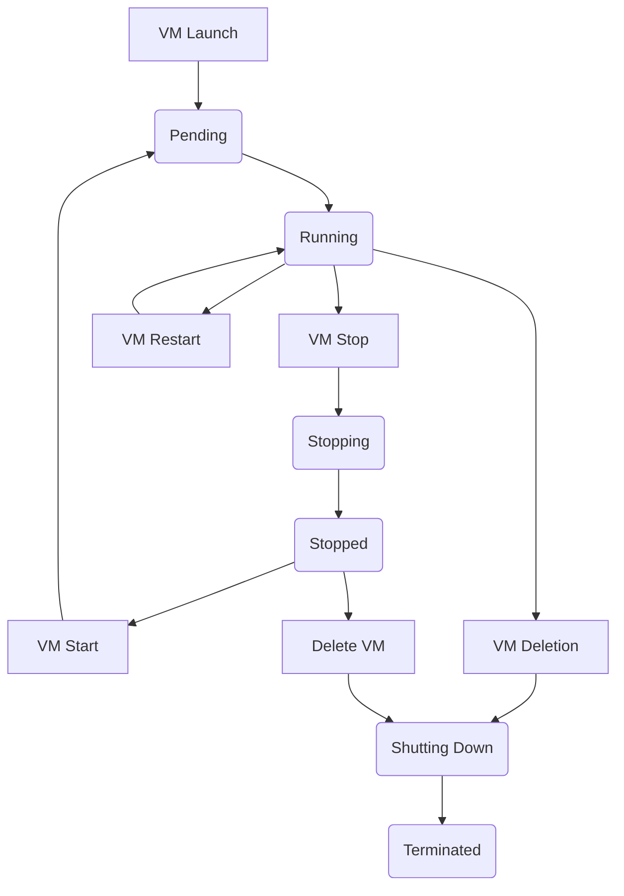

# Life cycle of a VM

A [VM (Virtual Machine)](/docs/compute/concept/) goes through different states between the moment you launch it and the moment you terminate it. You can manage their life cycle, which has consequences on the resources allocated or attached to it.

The following illustration represents the transitions between the states of a VM:



## Creation

Creating a VM corresponds to both creating it and then starting it. Once the VM is created, it is in the "pending" state until it is created, started and ready to use. The state of the VM then moves to "running".

Creating a VM allocates the corresponding hardware resources to it. You define the hardware configuration of the server that hosts it using a VM type, then the operating system, its configuration and possibly software applications using an Image.

The VM receives a unique ID, as well as a private IP (Internet Protocol) and an associated private DNS (Domain Name System) name.

> To assign a public IP address to a VM in a [VPC (Virtual Private Cloud)](/docs/network/vpc/concepts/), you can attach a public IP to it.

You can also attach NIC (Network Interface Card) to a VM when it is created or later to segment its network.

## Stop and start

You can stop a running ("running") VM at any time, then start it again. Stopping a VM with the API corresponds to shutting it down with the operating system command.

You can also force the stop of a VM. This action stops the VM without properly closing the applications in use.

:::warning
Forcing the stop of a VM can damage the system and corrupt the data.
:::

When you stop a VM, it moves to the "stopping" state, then to the "stopped" state. When you start a stopped VM, it is in the "pending" state, then moves to the "running" state.

When the VM is stopped and started, it keeps:

- its ID;
- its private IP and associated private DNS name;
- the attached volumes;
- the public IP attached to it.

:::tip
To process a volume attached to a VM, follow these steps:
1. Stop the VM;
2. Detach the volume;
3. Attach it to another VM to process it;
4. Reattach it to the original VM (using the same device name as in the block device mapping);
5. Start the VM.
:::

:::tip
For a VM registered with a [load balancer](/docs/network/load-balancer/concepts/):
1. Deregister the VM from the load balancer;
2. Stop the VM;
3. Start the VM;
4. Re-register the VM with the load balancer if necessary.
:::

### Common causes of start failure

#### Missing system volume

Starting a VM fails when no volume is attached to its root device (by default, `/dev/sda1`). This situation occurs in particular after replacing the volumes of a VM.

The API then returns a `409 Conflict` error whose message identifies the affected root device.

**Possible solutions:**
- Reattach the original system volume to the VM, using the same device name as in the block device mapping (`/dev/sda1` by default);
- If the original system volume is lost, create a new VM from an official Image and restore the data from a backup.

## Forced stop

:::warning
The forced stop of a VM is a risky operation that can damage the system and corrupt the data. Use this option only as a last resort and make sure you have a backup of your data.
:::

The forced stop of a VM corresponds to an abrupt power cut, similar to unplugging the power supply. This method can prevent the system from shutting down properly.

:::tip
Before proceeding with a forced stop, view the console output of the VM to identify the cause of the problem.
:::

### Common causes of stop failure

#### Running program

The most frequent cause is a program that uses a file system (for example, NFS or CRFS). In this case, the file system cannot be unmounted, which prevents the VM from stopping.

**Possible solutions:**
- wait for the program to finish naturally;
- stop the program manually;
- unmount the volume concerned.

#### System update in progress

:::warning
Never force the stop of a VM during a system update. This can:
- damage your VM;
- prevent the restart;
- corrupt the system data.
:::

:::tip
Updates can take several hours on low-capacity VM. Be patient and monitor the progress.
:::

#### ACPI problems

ACPI (Advanced Configuration and Power Interface) problems can occur for two main reasons:

1. **VM out of service**: the ACPI requests are ignored;
2. **Missing modules**: the `pci-hotplug` and `acpiphp` modules are not installed.

To check that the required modules are present, view the `/etc/modules` file:

```shell
#/etc/modules: kernel modules to load at boot time.
#
#This file contains the names of kernel modules that should be loaded
#at boot time, one per line. Lines beginning with "#" are ignored.
#Parameters can be specified after the module name.
pci-hotplug
acpiphp
```

:::tip
If the modules are missing, create a new Image from an official Image and recreate your VM.
:::

:::danger
If the VM still does not respond after a forced stop, contact our Support team. In this case, the support team must carry out a forced shutdown, which could corrupt your data. Make sure you have made a backup before any intervention.
:::

## Restart

:::tip
Restarting a VM is a fast operation that keeps all the resources and data in memory.
:::

Restarting a VM is performed via the API and corresponds to a restart of the operating system. This operation:
- does not follow the full stop/start process;
- keeps the VM in the `running` state;
- keeps all the allocated resources: CPU (Central Processing Unit) allocation, RAM (Random Access Memory) allocation, hypervisor on which the VM is instantiated.

## Deletion

:::warning
Deleting a VM is an irreversible operation. The data in memory is lost and the VM cannot be recovered.
:::

### Deletion process

1. The VM moves to the `shutting-down` state;
2. Once the deletion is complete, it moves to the `terminated` state;
3. The VM remains visible in the `terminated` state for 1 hour;
4. After 1 hour, the VM is permanently deleted.

### Consequences of the deletion

- **Resources**: all the hardware resources are released;
- **Memory**: the data in memory is erased;
- **Public IP**: the public IP is released but remains allocated to your account;
- **Volumes**:
  - the system volume is deleted by default;
  - the other volumes are detached.

### Deletion protection

:::tip
These protections can be configured when the VM is created or modified later.
:::

#### Protection attributes

1. **`DisableApiTermination`**
   - prevents the deletion of the VM;
   - by default: deletion allowed.

2. **`InstanceInitiatedShutDownBehavior`**
   - defines the behavior on stop/termination;
   - available options:
     - `stop` (default): stops the VM;
     - `restart`: stops then restarts automatically;
     - `terminate`: stops then terminates the VM.

:::tip
The `terminate` option is useful to automate the deletion of a VM at the end of an application.
:::

## Comparison of operations

The following table compares the main characteristics of the different operations on a VM:

| Characteristics | Restart | Stop/start | Terminate |
|:----------------|:-----------|:----------------|:---------|
| **Host computer** | Same host | New host (possibly) | Deleted |
| **Public IP** | Kept | Detached | Released (remains allocated) |
| **Private IP** | Kept | Kept | Released |
| **Root volume** | Kept | Kept | Deleted by default |
| **RAM allocation** | Kept | Released | Released |
| **RAM memory content** | Erased | Erased | Erased |
| **Billing** | Continues | Stopped (VM) / Continues (volumes) | Stopped |
