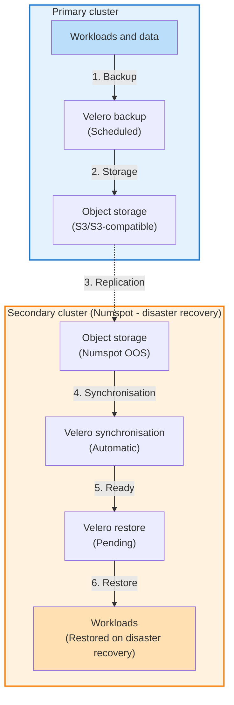

# Kubernetes backups and restores

## Introduction

Velero is an open source tool that lets you securely back up and restore the resources of a [Kubernetes cluster](/docs/managed-services/kubernetes/concepts/), perform disaster recovery, and migrate resources and persistent volumes to another cluster. This guide covers:

- the full installation on Numspot Kubernetes;
- backup strategies for etcd and the nodes;
- the full cluster backup and restore procedures;
- cross-provider migration scenarios;
- the integration with the Numspot Outscale BSU CSI driver.

### Key features

- **Backup and restore**: full cluster backups including namespaces, resources and persistent volumes;
- **Disaster recovery**: full cluster restore from the backup storage;
- **Cluster migration**: migration of workloads between clusters and cloud providers;
- **Scheduled backups**: automated backup policies with retention;
- **Selective backup**: backup of specific namespaces, resources or labels.

---

## Prerequisites

### On the Numspot cluster

- a Kubernetes cluster v1.16+ with DNS and container networking enabled;
- `kubectl` installed and configured;
- access to object storage (S3-compatible);
- a CSI driver for persistent volumes (Outscale BSU CSI is available by default).

### Storage prerequisites

Velero requires two types of storage:

1. Object storage: for backup metadata and Kubernetes resource manifests (S3-compatible).
2. Volume snapshots: for persistent volume data (uses Outscale BSU snapshots).

### Required information

- the object storage bucket name and the credentials;
- the bucket region (for the Numspot Standard region: `eu-west-2`);
- the access key and the secret key for the S3-compatible storage.

---

## Installation

### Step 1: Install the Velero CLI

**macOS**

```bash
# With Homebrew
brew install velero

# Or manual download
cd /tmp
curl -sLO https://github.com/vmware-tanzu/velero/releases/download/v1.13.2/velero-v1.13.2-darwin-amd64.tar.gz
tar -xzf velero-v1.13.2-darwin-amd64.tar.gz
mkdir -p ~/bin
mv velero-v1.13.2-darwin-amd64/velero ~/bin/
export PATH=$PATH:~/bin
```

**Linux**

```bash
cd /tmp
curl -sLO https://github.com/vmware-tanzu/velero/releases/download/v1.13.2/velero-v1.13.2-linux-amd64.tar.gz
tar -xzf velero-v1.13.2-linux-amd64.tar.gz
sudo mv velero-v1.13.2-linux-amd64/velero /usr/local/bin/
```

Verify the installation:

```bash
velero version --client-only
```

### Step 2: Create the S3-compatible storage credentials

Velero requires credentials to access the object storage. Create a credentials file:

```bash
cat > ~/.aws/credentials-velero <<EOF
[default]
aws_access_key_id = YOUR_ACCESS_KEY
aws_secret_access_key = YOUR_SECRET_KEY
EOF
```

**For Numspot object storage**:

- obtain the credentials from the Numspot Console;
- store them in the IAM section;
- the endpoint will be: `https://oos.eu-west-2.numspot.com`.

### Step 3: Install Velero on the cluster

**Option A: Use S3-compatible object storage (recommended for Numspot)**

```bash
velero install \
  --provider aws \
  --plugins velero/velero-plugin-for-aws:v1.9.2 \
  --bucket YOUR_BUCKET_NAME \
  --region eu-west-2 \
  --secret-file ~/.aws/credentials-velero \
  --backup-location-config region=eu-west-2,s3ForcePathStyle=true,s3Url=https://oos.eu-west-2.numspot.com \
  --snapshot-location-config region=eu-west-2 \
  --use-volume-snapshots=true \
  --use-node-agent \
  --features=EnableCSI \
  --namespace velero
```

**Main parameters**:

- `--provider aws`: uses the AWS plugin (S3-compatible).
- `--plugins`: AWS plugin for S3 operations.
- `--bucket`: the name of your object storage bucket.
- `--region`: the Numspot region (`eu-west-2`).
- `--s3ForcePathStyle=true`: required for S3-compatible storage.
- `--s3Url`: the Numspot object storage endpoint.
- `--use-node-agent`: enables file system backup for volumes.
- `--features=EnableCSI`: enables CSI snapshot support (block storage volumes).

**Option B: Minimal installation (without CSI snapshots)**

If you do not need persistent volume snapshots:

```bash
velero install \
  --provider aws \
  --plugins velero/velero-plugin-for-aws:v1.9.2 \
  --bucket YOUR_BUCKET_NAME \
  --region eu-west-2 \
  --secret-file ~/.aws/credentials-velero \
  --backup-location-config region=eu-west-2,s3ForcePathStyle=true,s3Url=https://oos.eu-west-2.numspot.com \
  --use-volume-snapshots=false
```

### Step 4: Verify the installation

```bash
# Check the Velero pods
kubectl get pods -n velero

# Check the backup storage location
velero backup-location get

# Check the snapshot location
velero snapshot-location get

# Check the Velero version
velero version
```

Expected output:

```text
NAME      PHASE       LAST VALIDATED   ACCESS MODE   DEFAULT
default   Available   1m ago           ReadWrite     true

NAME      PROVIDER   LOCATION
default   aws        eu-west-2
```

---

## Configuration

### Configure the backup storage location

If you need to add additional backup locations:

```bash
velero backup-location create secondary-backup \
  --provider aws \
  --bucket SECONDARY_BUCKET \
  --region eu-west-2 \
  --config region=eu-west-2,s3ForcePathStyle=true,s3Url=https://oos.eu-west-2.numspot.com
```

### Configure the snapshot location

Add snapshot locations for different regions:

```bash
velero snapshot-location create secondary-snapshots \
  --provider aws \
  --config region=eu-west-2
```

### Set the default backup lifetime

Create a schedule with a retention policy:

```bash
velero schedule create daily-backup \
  --schedule="0 2 * * *" \
  --include-namespaces '*' \
  --ttl 720h0m0s  # 30-day retention
```

### Configure the resource requests

Edit the Velero deployment for larger clusters:

```bash
kubectl set resources deployment/velero \
  -n velero \
  --containers=velero \
  --requests=cpu=500m,memory=512Mi \
  --limits=cpu=1000m,memory=1Gi
```

---

## Backup operations

### Backup types

**1. Full cluster backup**

Back up all resources, including cluster-scoped resources:

```bash
velero backup create full-cluster-backup \
  --include-cluster-resources=true \
  --wait

# Check the backup status
velero backup describe full-cluster-backup --details
velero backup logs full-cluster-backup
```

**2. Specific namespace backup**

Back up only specific namespaces:

```bash
velero backup create app-backup \
  --include-namespaces myapp \
  --wait
```

Several namespaces:

```bash
velero backup create multi-ns-backup \
  --include-namespaces ns1,ns2,ns3 \
  --wait
```

**3. Label-based backup**

Back up the resources matching specific labels:

```bash
velero backup create labeled-backup \
  --selector app=myapp \
  --wait
```

**4. Backup with volume snapshots**

Explicitly include the persistent volumes:

```bash
velero backup create pvc-backup \
  --include-namespaces myapp \
  --snapshot-volumes \
  --wait
```

**5. File system backup (FSB)**

For applications requiring consistent backups:

```bash
# Annotate the pods for FSB
kubectl annotate pod/myapp-pod -n myapp \
  backup.velero.io/backup-volumes=app-data

# Create the backup
velero backup create fsb-backup \
  --include-namespaces myapp \
  --wait
```

**6. Scheduled backups**

Create recurring backups:

```bash
# Daily backup at 2 a.m.
velero schedule create daily-backup \
  --schedule="0 2 * * *" \
  --include-namespaces '*' \
  --include-cluster-resources=true \
  --ttl 168h0m0s  # 7-day retention

# Hourly backup
velero schedule create hourly-backup \
  --schedule="0 * * * *" \
  --include-namespaces production \
  --ttl 24h0m0s

# Weekly full backup
velero schedule create weekly-full \
  --schedule="0 3 * * 0" \
  --include-cluster-resources=true \
  --ttl 720h0m0s  # 30-day retention
```

### Back up the etcd data

Velero does not back up etcd directly, but it captures all Kubernetes API objects. For a full etcd backup:

```bash
# Method 1: full Velero cluster backup (captures all API objects)
velero backup create etcd-backup \
  --include-cluster-resources=true \
  --include-namespaces '*' \
  --wait

# Method 2: direct etcd snapshot (run via kubectl)
kubectl exec -n kube-system etcd-<node-name> -- \
  etcdctl snapshot save /var/lib/etcd/backup.db \
  --cacert=/etc/kubernetes/pki/etcd/ca.crt \
  --cert=/etc/kubernetes/pki/etcd/peer.crt \
  --key=/etc/kubernetes/pki/etcd/peer.key
```

### Back up the node information

Velero captures the node resources, but does not back up the operating system or the node configuration. For a full node backup:

```bash
# Backup of the node labels and taints (captured by Velero)
velero backup create nodes-backup \
  --include-resources nodes \
  --include-cluster-resources=true \
  --wait

# Manual backup of the node configuration (external)
kubectl get nodes -o yaml > nodes-config-backup.yaml
```

### Exclude specific resources

```bash
# Exclude a specific namespace
velero backup create backup-exclude \
  --exclude-namespaces kube-system,velero \
  --wait

# Exclude by label
kubectl label namespace test-ns velero.io/exclude-from-backup=true
velero backup create backup-no-test
```

### Verify the backups

```bash
# List all backups
velero backup get

# Backup details
velero backup describe BACKUP_NAME --details

# Backup logs
velero backup logs BACKUP_NAME

# Check the backup content (download the tarball)
velero backup download BACKUP_NAME
tar -tzf BACKUP_NAME.tar.gz
```

---

## Restore operations

### Restore types

**1. Full cluster restore**

Restore everything from a backup:

```bash
velero restore create --from-backup full-cluster-backup \
  --wait

# Check the restore status
velero restore describe RESTORE_NAME --details
velero restore logs RESTORE_NAME
```

**2. Namespace restore**

Restore specific namespaces:

```bash
velero restore create restore-app \
  --from-backup app-backup \
  --include-namespaces myapp \
  --wait
```

**3. Restore into a different namespace**

Restore into a new namespace:

```bash
velero restore create restore-to-new \
  --from-backup app-backup \
  --namespace-mappings myapp:myapp-restored \
  --wait
```

**4. Selective resource restore**

Restore specific resource types:

```bash
velero restore create restore-deployments \
  --from-backup app-backup \
  --include-resources deployments,services \
  --wait
```

**5. Restore with resource modifiers**

Modify the resources during the restore:

Create a restore resource modifier:

```yaml
apiVersion: v1
kind: ConfigMap
metadata:
  name: restore-modifiers
  namespace: velero
data:
  modifiers.yaml: |
    - version: v1
      kind: Service
      name: my-service
      namespace: myapp
      operations:
        - op: replace
          path: /spec/type
          value: LoadBalancer
---
apiVersion: velero.io/v1
kind: Restore
metadata:
  name: modified-restore
  namespace: velero
spec:
  backupName: app-backup
  includedNamespaces:
    - myapp
  restorePVs: true
  preserveNodePorts: true
```

**6. Persistent volume restore**

```bash
# Restore with volume re-creation
velero restore create restore-volumes \
  --from-backup pvc-backup \
  --restore-volumes \
  --existing-resource-policy update \
  --wait
```

### Restore etcd

The Velero restore re-creates all Kubernetes API objects:

```bash
# Restore all resources (similar to an etcd restore)
velero restore create etcd-restore \
  --from-backup etcd-backup \
  --include-cluster-resources=true \
  --wait
```

For a direct etcd restore from a snapshot:

```bash
# Stop etcd
kubectl exec -n kube-system etcd-<node-name> -- \
  mv /var/lib/etcd/member /var/lib/etcd/member.bak

# Restore from the snapshot
kubectl exec -n kube-system etcd-<node-name> -- \
  etcdctl snapshot restore /var/lib/etcd/backup.db
```

### Restore hooks

Run commands during the restore:

```yaml
apiVersion: velero.io/v1
kind: Restore
metadata:
  name: hook-restore
  namespace: velero
spec:
  backupName: app-backup
  hooks:
    resources:
      - name: pre-hook
        includedNamespaces:
          - myapp
        labelSelector:
          matchLabels:
            app: myapp
        postHooks:
          - exec:
              container: app
              command:
                - /bin/sh
                - -c
                - "mysql -u root -p$MYSQL_ROOT_PASSWORD < /backup/init.sql"
```

### Handle restore conflicts

When restoring onto existing resources:

```bash
# Update the existing resources
velero restore create restore-update \
  --from-backup app-backup \
  --existing-resource-policy update \
  --wait

# Delete and re-create
velero restore create restore-recreate \
  --from-backup app-backup \
  --existing-resource-policy delete \
  --wait

# Skip the existing resources (none)
velero restore create restore-skip \
  --from-backup app-backup \
  --existing-resource-policy none \
  --wait
```

---

## Cluster migration

### Scenario 1: Migrate to another Numspot cluster

**On the source cluster**

1. **Create a full backup**:

```bash
velero backup create migration-backup \
  --include-namespaces '*' \
  --include-cluster-resources=true \
  --snapshot-volumes \
  --wait
```

2. **Verify the backup completion**:

```bash
velero backup describe migration-backup --details
```

3. **Ensure the backup upload**:

```bash
velero backup logs migration-backup
```

**On the destination cluster (same provider)**

1. **Install Velero with the same storage**:

```bash
# Use the SAME bucket and the SAME credentials as the source
velero install \
  --provider aws \
  --plugins velero/velero-plugin-for-aws:v1.9.2 \
  --bucket YOUR_BUCKET_NAME \
  --region eu-west-2 \
  --secret-file ~/.aws/credentials-velero \
  --backup-location-config region=eu-west-2,s3ForcePathStyle=true,s3Url=https://oos.eu-west-2.numspot.com \
  --snapshot-location-config region=eu-west-2 \
  --use-volume-snapshots=true \
  --use-node-agent \
  --features=EnableCSI
```

2. **Wait for the backup synchronization**:

```bash
# Velero will automatically synchronise the backups from the object storage
velero backup get
```

3. **Restore onto the new cluster**:

```bash
velero restore create migration-restore \
  --from-backup migration-backup \
  --include-cluster-resources=true \
  --wait
```

4. **Verify the restore**:

```bash
kubectl get all --all-namespaces
velero restore describe migration-restore --details
```

### Scenario 2: Migrate from a non-Numspot provider (AWS, GCP, Azure)

**On the source cluster (other provider)**

1. **Install Velero on the source** (AWS example):

```bash
velero install \
  --provider aws \
  --plugins velero/velero-plugin-for-aws:v1.9.2 \
  --bucket aws-backup-bucket \
  --region us-east-1 \
  --secret-file ~/.aws/credentials \
  --backup-location-config region=us-east-1 \
  --use-volume-snapshots=true
```

2. **Create the backup**:

```bash
velero backup create aws-to-numspot-backup \
  --include-namespaces production \
  --snapshot-volumes \
  --wait
```

3. **Copy the backup to the Numspot storage**:

```bash
# Download the backup from the source
velero backup download aws-to-numspot-backup

# Upload to the Numspot storage using the AWS CLI or an S3-compatible tool
aws s3 cp aws-to-numspot-backup.tar.gz \
  s3://numspot-backup-bucket/backups/aws-to-numspot-backup/ \
  --endpoint-url=https://oos.eu-west-2.numspot.com
```

**On the Numspot destination cluster**

1. **Install Velero on Numspot**:

```bash
velero install \
  --provider aws \
  --plugins velero/velero-plugin-for-aws:v1.9.2 \
  --bucket numspot-backup-bucket \
  --region eu-west-2 \
  --secret-file ~/.aws/credentials-velero \
  --backup-location-config region=eu-west-2,s3ForcePathStyle=true,s3Url=https://oos.eu-west-2.numspot.com \
  --use-volume-snapshots=false
```

2. **Wait for the backup synchronization**:

```bash
velero backup get
```

3. **Create the restore with adjustments**:

```bash
velero restore create aws-restore \
  --from-backup aws-to-numspot-backup \
  --restore-volumes=false \
  --existing-resource-policy update \
  --wait
```

:::info Note
Storage snapshots differ between providers. You will need to carry out the following actions:

- re-create the PV manually or use volume cloning;
- update the StorageClass references to Numspot-compatible classes (`gp2`, `io1`, `standard`);
- adjust the node selectors and the affinity rules.
:::

### Scenario 3: Restore a cross-provider Velero backup on Numspot

**Prerequisites**

The following prerequisites are required:

- a Velero backup from another provider (AWS, GCP, Azure);
- access to the backup storage (this can be from a different S3);
- a ready Numspot cluster.

**Step-by-step procedure**

1. **Access the backup location**:

Option A: Temporarily use the original backup location:

```bash
velero backup-location create external-backup \
  --provider aws \
  --bucket original-backup-bucket \
  --config region=us-east-1 \
  --access-mode=ReadOnly
```

Option B: Copy the backup to the Numspot storage:

```bash
# From an external source
aws s3 sync s3://original-bucket/backups/external-backup/ \
  s3://numspot-bucket/backups/external-backup/ \
  --endpoint-url=https://oos.eu-west-2.numspot.com
```

2. **Configure Velero to access the external backup**:

Create a secret with the external credentials:

```bash
kubectl create secret generic external-backup-credentials \
  -n velero \
  --from-file=cloud=~/.aws/credentials-external
```

3. **Create a BackupStorageLocation for the external backup**:

```yaml
apiVersion: velero.io/v1
kind: BackupStorageLocation
metadata:
  name: external-source
  namespace: velero
spec:
  provider: aws
  objectStorage:
    bucket: external-backup-bucket
  config:
    region: us-east-1
    s3Url: https://s3.amazonaws.com
  credential:
    name: external-backup-credentials
    key: cloud
  accessMode: ReadOnly
```

4. **Wait for the backup synchronization**:

```bash
velero backup get
```

5. **Restore with provider-specific adjustments**:

Create a restore resource modifier for the provider differences:

```yaml
apiVersion: v1
kind: ConfigMap
metadata:
  name: cross-provider-modifiers
  namespace: velero
data:
  modifiers.yaml: |
    - version: v1
      kind: PersistentVolumeClaim
      operations:
        - op: replace
          path: /spec/storageClassName
          value: gp2
    - version: v1
      kind: Service
      operations:
        - op: remove
          path: /spec/loadBalancerSourceRanges
```

Apply the restore:

```bash
velero restore create cross-provider-restore \
  --from-backup external-backup \
  --existing-resource-policy update \
  --restore-volumes=false \
  --wait
```

6. **Handle the persistent volumes**:

As the snapshots are provider-specific, you need alternative approaches:

**Method 1: Restore the volume data manually**

```bash
# Export the volume data from the source provider
# Import into Numspot

# Create new PVC in Numspot
kubectl apply -f - <<EOF
apiVersion: v1
kind: PersistentVolumeClaim
metadata:
  name: restored-pvc
  namespace: production
spec:
  storageClassName: gp2
  accessModes:
    - ReadWriteOnce
  resources:
    requests:
      storage: 10Gi
EOF

# Copy the data
kubectl cp source-data.tar.gz production/pod:/data/
```

**Method 2: Use Velero file system backup (FSB)**

```bash
# On the source, before the backup
kubectl annotate pod/myapp-pod -n production \
  backup.velero.io/backup-volumes=app-data

# Create a backup with FSB
velero backup create fsb-cross-provider-backup \
  --include-namespaces production \
  --snapshot-volumes=false \
  --use-restic

# On Numspot, restore
velero restore create fsb-restore \
  --from-backup fsb-cross-provider-backup \
  --wait
```

7. **Adjust the provider-specific configurations**:

```bash
# Update the node selectors
kubectl patch deployment myapp -n production --type=json \
  -p='[{"op": "remove", "path": "/spec/template/spec/nodeSelector"}]'

# Update the StorageClass references
kubectl get pvc --all-namespaces -o yaml | \
  sed 's/storageClassName: gp3/storageClassName: gp2/g' | \
  kubectl apply -f -
```

8. **Verify the restore**:

```bash
# Check the restored resources
kubectl get all --all-namespaces

# Check the PV
kubectl get pv

# Check the Velero restore logs
velero restore describe cross-provider-restore --details
velero restore logs cross-provider-restore
```

---

## Cross-provider disaster recovery

### Architecture overview

This diagram shows a cross-provider disaster recovery architecture where the backups from a primary cluster are replicated to a secondary Numspot cluster:



### Disaster recovery strategy 1: Active-Passive (cold standby)

**Configuration**:

- the primary cluster runs the production workloads;
- the secondary Numspot cluster has Velero installed and synchronizes the backups;
- manual restore when disaster recovery is invoked.

**Implementation**:

1. **Configure the primary cluster for backups**:

```bash
# On the primary cluster (e.g. AWS)
velero schedule create production-backup \
  --schedule="*/30 * * * *" \
  --include-namespaces production \
  --snapshot-volumes \
  --ttl 168h0m0s
```

2. **Configure cross-region replication for the backup storage**:

- use S3 cross-region replication (if AWS to Numspot);
- or implement custom synchronization.

3. **Configure the secondary Numspot cluster**:

```bash
velero install \
  --provider aws \
  --plugins velero/velero-plugin-for-aws:v1.9.2 \
  --bucket replicated-backup-bucket \
  --region eu-west-2 \
  --secret-file ~/.aws/credentials-velero \
  --backup-location-config region=eu-west-2,s3ForcePathStyle=true,s3Url=https://oos.eu-west-2.numspot.com
```

4. **Create a disaster recovery automation script**:

```bash
#!/bin/bash
# dr-restore.sh

BACKUP_NAME=$(velero backup get --sort-by=.metadata.creationTimestamp -o json | jq -r '.items[-1].metadata.name')

echo "Latest backup: $BACKUP_NAME"

velero restore create dr-restore-$(date +%Y%m%d-%H%M%S) \
  --from-backup $BACKUP_NAME \
  --include-namespaces production \
  --existing-resource-policy update \
  --wait

echo "Disaster recovery complete"
```

### Disaster recovery strategy 2: Active-Active with DNS failover

**Configuration**:

- both clusters run the production workloads;
- DNS failover (Route53, CloudFlare);
- data replication through Velero + database replication.

**Implementation**:

1. **Configure a bidirectional backup**:

```bash
# On both clusters
velero schedule create bidirectional-backup \
  --schedule="*/15 * * * *" \
  --include-namespaces production \
  --ttl 72h0m0s
```

2. **Database replication**:

- use native database replication (MySQL Group Replication, PostgreSQL streaming);
- or use application-level replication.

3. **DNS failover configuration**:

```json
{
  "Failover": {
    "Primary": "production.primary-cluster.com",
    "Secondary": "production.numspot-cluster.com",
    "HealthCheck": "/health",
    "TTL": 60
  }
}
```

### Disaster recovery strategy 3: Pilot Light

**Configuration**:

- the core infrastructure always runs on Numspot;
- the application servers are restored on demand;
- the database replicas are maintained continuously.

**Implementation**:

1. **Keep the core services on Numspot**:

```yaml
# Core services always running
apiVersion: v1
kind: Namespace
metadata:
  name: core-services
---
apiVersion: apps/v1
kind: Deployment
metadata:
  name: database-replica
  namespace: core-services
spec:
  replicas: 1
  template:
    spec:
      containers:
      - name: postgres
        image: postgres:15
        env:
        - name: POSTGRES_HOST_AUTH_METHOD
          value: trust
```

2. **Back up only the application tier**:

```bash
velero schedule create app-tier-backup \
  --schedule="0 */2 * * *" \
  --include-resources deployments,services,configmaps,secrets \
  --include-namespaces production \
  --exclude-resources persistentvolumes,persistentvolumeclaims
```

3. **Disaster recovery procedure**:

```bash
#!/bin/bash
# pilot-light-activate.sh

# Restore the application tier
velero restore create activate-pilot \
  --from-backup app-tier-backup-$(date +%Y%m%d) \
  --existing-resource-policy create \
  --wait

# Scale the applications
kubectl scale deployment --all -n production --replicas=3

# Update the DNS
aws route53 change-resource-record-sets \
  --hosted-zone-id $HOSTED_ZONE_ID \
  --change-batch file://dns-failover.json
```

---

## Best practices

### 1. Backup strategy

**Frequency**:

- Production: every 15-30 minutes;
- Staging: every 4 hours;
- Development: daily.

**Retention**:

- hourly backups: 24 hours;
- daily backups: 30 days;
- weekly backups: 90 days;
- monthly backups: 1 year.

**Implementation**:

```bash
# Multiple schedules with different retentions
velero schedule create hourly-prod \
  --schedule="0 * * * *" \
  --include-namespaces production \
  --ttl 24h0m0s

velero schedule create daily-prod \
  --schedule="0 2 * * *" \
  --include-namespaces production \
  --include-cluster-resources=true \
  --ttl 720h0m0s

velero schedule create weekly-full \
  --schedule="0 3 * * 0" \
  --include-namespaces '*' \
  --include-cluster-resources=true \
  --ttl 2160h0m0s
```

### 2. Resource management

**Exclude unnecessary resources**:

```bash
velero backup create optimized-backup \
  --exclude-namespaces kube-system,velero,default \
  --exclude-resources events,pods,secret \
  --include-cluster-resources=true
```

**Use labels efficiently**:

```bash
# Label the critical resources
kubectl label namespace production backup-priority=critical

# Back up by priority
velero backup create critical-backup \
  --selector backup-priority=critical
```

### 3. Storage optimization

**Configure compression**:

```bash
velero install \
  --provider aws \
  --backup-location-config compress=true \
  --bucket YOUR_BUCKET
```

**Monitor the storage usage**:

```bash
# Check the backup sizes
velero backup get -o json | jq '.items[] | {name:.metadata.name, size:.status.totalSize}'
```

### 4. Security

**Encrypt the backups at rest**:

```bash
# Use server-side encryption
velero install \
  --backup-location-config s3ServerSideEncryption=AES256
```

**Encrypt the backups in transit**:

```bash
# Ensure that TLS is enabled
velero install \
  --backup-location-config s3Url=https://oos.eu-west-2.numspot.com
```

**Restrict the Velero permissions**:

```yaml
apiVersion: rbac.authorization.k8s.io/v1
kind: ClusterRole
metadata:
  name: velero-restricted
rules:
- apiGroups: [""]
  resources: ["pods", "pvc", "configmaps", "secrets"]
  verbs: ["get", "list", "create", "update", "delete"]
- apiGroups: ["apps"]
  resources: ["deployments", "statefulsets", "daemonsets"]
  verbs: ["get", "list", "create", "update", "delete"]
```

### 5. Testing

**Regular restore tests**:

```bash
#!/bin/bash
# test-restore.sh

# Create a test backup
velero backup create test-backup-$(date +%Y%m%d) \
  --include-namespaces test-application \
  --wait

# Delete the test namespace
kubectl delete namespace test-application --wait=true

# Restore
velero restore create test-restore-$(date +%Y%m%d) \
  --from-backup test-backup-$(date +%Y%m%d) \
  --wait

# Verify
kubectl get all -n test-application
```

**Schedule the restore tests**:

```bash
# Weekly restore test (requires automation)
velero schedule create restore-test \
  --schedule="0 0 * * 0" \
  --include-namespaces test-restore
```

### 6. Monitoring and alerting

**Prometheus metrics**:

```yaml
apiVersion: monitoring.coreos.com/v1
kind: ServiceMonitor
metadata:
  name: velero
  namespace: velero
spec:
  selector:
    matchLabels:
      app.kubernetes.io/name: velero
  endpoints:
  - port: metrics
    interval: 30s
```

**Key metrics to monitor**:

- `velero_backup_attempt_total`;
- `velero_backup_success_total`;
- `velero_backup_failure_total`;
- `velero_backup_duration_seconds`;
- `velero_restore_attempt_total`;
- `velero_restore_success_total`.

**Alerting rules**:

```yaml
apiVersion: monitoring.coreos.com/v1
kind: PrometheusRule
metadata:
  name: velero-alerts
  namespace: velero
spec:
  groups:
  - name: velero
    rules:
    - alert: VeleroBackupFailing
      expr: rate(velero_backup_failure_total[1h]) > 0
      for: 5m
      labels:
        severity: critical
      annotations:
        summary: "The Velero backup is failing"
        description: "The Velero backup has failed {{ $value }} times over the last hour"

    - alert: VeleroBackupTooOld
      expr: time() - velero_backup_last_successful_timestamp > 86400
      for: 1h
      labels:
        severity: warning
      annotations:
        summary: "No successful backup over the last 24 hours"
```

---

## Troubleshooting

### Common issues

**1. Backup stuck in "InProgress"**

**Diagnosis**:

```bash
velero backup describe BACKUP_NAME --details
kubectl logs -n velero deployment/velero
```

**Solution**:

```bash
# Check the stuck volumes
kubectl get volumesnapshot -n velero

# Abort the stuck backup
kubectl patch backup BACKUP_NAME -n velero --type merge -p '{"status":{"phase":"Failed"}}'

# Clean up
kubectl delete backup BACKUP_NAME -n velero
```

**2. Volume snapshot failures**

**Diagnosis**:

```bash
# Check the CSI driver logs
kubectl logs -n kube-system ds/osc-csi-node

# Check the snapshot status
kubectl get volumesnapshotsnapshotcontent -A
```

**Solution**:

```bash
# Use file system backup instead
velero backup create fsb-backup \
  --include-namespaces myapp \
  --snapshot-volumes=false

# Annotate the pods
kubectl annotate pod/myapp-pod -n myapp \
  backup.velero.io/backup-volumes=<volume-name>
```

**3. Restore failure with "Resource Already Exists"**

**Diagnosis**:

```bash
velero restore describe RESTORE_NAME --details
```

**Solution**:

```bash
# Use the update policy
velero restore create restore-update \
  --from-backup BACKUP_NAME \
  --existing-resource-policy update \
  --wait

# Or delete the existing resources
kubectl delete namespace NAMESPACE
velero restore create restore-clean \
  --from-backup BACKUP_NAME
```

**4. Backup storage location unavailable**

**Diagnosis**:

```bash
velero backup-location get
kubectl logs -n velero deployment/velero | grep -i 'backup location'
```

**Solution**:

```bash
# Check the credentials
kubectl get secret -n velero cloud-credentials -o yaml

# Update the credentials
kubectl create secret generic cloud-credentials \
  -n velero \
  --from-file=cloud=~/.aws/credentials-velero \
  --dry-run=client -o yaml | kubectl apply -f -

# Restart Velero
kubectl rollout restart deployment/velero -n velero
```

**5. Cross-provider restore issues**

**Issue**: StorageClass mismatch

**Solution**:

```bash
# List the StorageClasses available on Numspot
kubectl get storageclass

# Map the StorageClasses
velero restore create cross-provider-restore \
  --from-backup external-backup \
  --restore-volumes=false

# Re-create the PVC with the correct StorageClass
kubectl get pvc -n production -o yaml | \
  sed 's/storageClassName: gp3/storageClassName: gp2/g' | \
  kubectl apply -f -
```

**Issue**: node affinity issues

**Solution**:

```bash
# Remove the node selectors
kubectl patch deployment DNAME -n NAMESPACE --type=json \
  -p='[{"op": "remove", "path": "/spec/template/spec/nodeSelector"}]'

# Or use a restore modifier
cat > /tmp/restore-modifier.yaml <<EOF
- version: v1
  kind: Deployment
  operations:
    - op: remove
      path: /spec/template/spec/nodeSelector
EOF

velero restore create modifier-restore \
  --from-backup backup \
  --restore-resource-modifier /tmp/restore-modifier.yaml
```

**6. Performance issues**

**Slow backups**:

**Diagnosis**:

```bash
# Velero logs
kubectl logs -n velero deployment/velero --tail=100 | grep -i 'duration'

# Check the resource limits
kubectl describe deployment velero -n velero
```

**Solution**:

```bash
# Increase the Velero resources
kubectl set resources deployment/velero \
  -n velero \
  --containers=velero \
  --requests=cpu=1000m,memory=1Gi \
  --limits=cpu=2000m,memory=2Gi

# Adjust the client page size
kubectl patch deployment velero -n velero --type=json \
  -p='[{"op": "add", "path": "/spec/template/spec/containers/0/args/-", "value": "--client-page-size=500"}]'

# Use parallel upload (for fs-backup)
velero backup create parallel-backup \
  --include-namespaces myapp \
  --parallel-files-upload 10
```

### Useful commands

```bash
# Get the Velero status
velero version
velero backup-location get
velero snapshot-location get
velero schedule get

# Debug the backup
velero backup describe BACKUP_NAME --details
velero backup logs BACKUP_NAME
velero backup download BACKUP_NAME

# Debug the restore
velero restore describe RESTORE_NAME --details
velero restore logs RESTORE_NAME

# Clean up
velero backup delete BACKUP_NAME
velero restore delete RESTORE_NAME

# Force synchronisation
kubectl rollout restart deployment/velero -n velero

# Check the plugin status
kubectl exec -n velero deployment/velero -- ./velero plugin get
```

---

## Quick reference

### Velero commands

```bash
# Backup
velero backup create NAME [flags]
velero backup get
velero backup describe NAME
velero backup logs NAME
velero backup delete NAME
velero backup download NAME

# Restore
velero restore create --from-backup NAME [flags]
velero restore get
velero restore describe NAME
velero restore logs NAME
velero restore delete NAME

# Schedule
velero schedule create NAME --schedule="CRON" [flags]
velero schedule get
velero schedule describe NAME
velero schedule delete NAME

# Location
velero backup-location get
velero snapshot-location get
```

### Common options

```bash
--include-namespaces ns1,ns2
--exclude-namespaces ns1,ns2
--include-resources pods,deployments
--exclude-resources secrets,events
--selector label=value
--include-cluster-resources
--snapshot-volumes
--restore-volumes
--ttl 168h0m0s
--existing-resource-policy [none|update|delete]
--namespace-mappings old:new
--wait
```

### CRON schedule examples

```bash
"0 * * * *"       # Every hour
"*/15 * * * *"    # Every 15 minutes
"0 2 * * *"       # Daily at 2 a.m.
"0 3 * * 0"       # Weekly on Sunday at 3 a.m.
"0 0 1 * *"       # Monthly on the 1st
```

---

## Conclusion

Velero provides full backup and disaster recovery capabilities for Kubernetes clusters on Numspot.

### Key takeaways

1. **Installation**: use the AWS plugin with the S3-compatible storage parameters for Numspot object storage;
2. **Backup strategy**: implement several schedules with different retention durations;
3. **Volume backup**: use Outscale BSU CSI for snapshots, or use file system backup for cross-provider compatibility;
4. **Disaster recovery**: choose the appropriate strategy (Active-Passive, Active-Active or Pilot Light);
5. **Cross-provider migration**: plan for StorageClass differences and volume migration strategies;
6. **Testing**: test the restores regularly to guarantee recoverability;
7. **Monitoring**: implement comprehensive monitoring and alerting for the backup operations.

For production environments:

- document your backup and restore procedures;
- test the disaster recovery scenarios;
- keep off-site backup copies;
- monitor the backup health and alert on failure;
- keep Velero and its plugins up to date.

---

## References

- [Official Velero documentation](https://velero.io/docs/)
- [Numspot Object Storage API](https://api.eu-west-2.numspot.com/openapi)
- [Kubernetes CSI documentation](https://kubernetes-csi.github.io/docs/)
- [Velero AWS plugin](https://github.com/vmware-tanzu/velero-plugin-for-aws)

---
