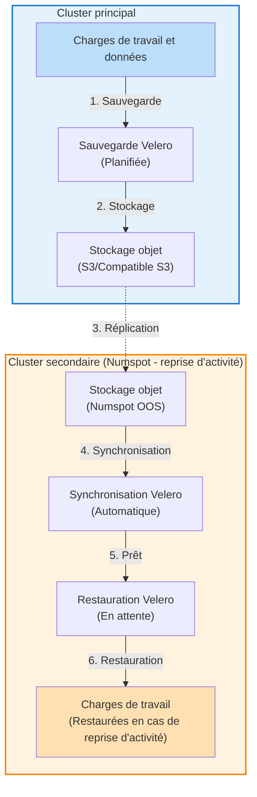

# Sauvegardes et restaurations Kubernetes

## Introduction

Velero est un outil open source permettant de sauvegarder et de restaurer en toute sécurité les ressources d'un [cluster Kubernetes](/docs/managed-services/kubernetes/concepts/), d'effectuer une reprise d'activité et de migrer les ressources et les volumes persistants vers un autre cluster. Ce guide couvre :

- l'installation complète sur Kubernetes Numspot ;
- les stratégies de sauvegarde pour etcd et les nœuds ;
- les procédures de sauvegarde et de restauration complètes du cluster ;
- les scénarios de migration inter-fournisseurs ;
- l'intégration avec le pilote CSI Outscale BSU de Numspot.

### Fonctionnalités clés

- **Sauvegarde et restauration** : sauvegardes complètes du cluster incluant les espaces de noms, les ressources et les volumes persistants ;
- **Reprise d'activité** : restauration complète du cluster depuis le stockage de sauvegarde ;
- **Migration de cluster** : migration des charges de travail entre clusters et fournisseurs cloud ;
- **Sauvegardes planifiées** : politiques de sauvegarde automatisées avec rétention ;
- **Sauvegarde sélective** : sauvegarde d'espaces de noms, de ressources ou d'étiquettes spécifiques.

---

## Prérequis

### Sur le cluster Numspot

- un cluster Kubernetes v1.16+ avec le DNS et la mise en réseau des conteneurs activés ;
- `kubectl` installé et configuré ;
- un accès au stockage objet (compatible S3) ;
- un pilote CSI pour les volumes persistants (Outscale BSU CSI est disponible par défaut).

### Prérequis de stockage

Velero nécessite deux types de stockage :

1. Stockage objet : pour les métadonnées de sauvegarde et les manifestes de ressources Kubernetes (compatible S3).
2. Instantanés de volumes : pour les données de volumes persistants (utilise les instantanés Outscale BSU).

### Informations requises

- le nom du compartiment (bucket) de stockage objet et les identifiants ;
- la région du compartiment (pour la région Numspot Standard : `eu-west-2`) ;
- la clé d'accès et la clé secrète pour le stockage compatible S3.

---

## Installation

### Étape 1 : Installer Velero CLI

**macOS**

```bash
# Avec Homebrew
brew install velero

# Ou téléchargement manuel
cd /tmp
curl -sLO https://github.com/vmware-tanzu/velero/releases/download/v1.13.2/velero-v1.13.2-darwin-amd64.tar.gz
tar -xzf velero-v1.13.2-darwin-amd64.tar.gz
mkdir -p ~/bin
mv velero-v1.13.2-darwin-amd64/velero ~/bin/
export PATH=$PATH:~/bin
```

**Linux**

```bash
cd /tmp
curl -sLO https://github.com/vmware-tanzu/velero/releases/download/v1.13.2/velero-v1.13.2-linux-amd64.tar.gz
tar -xzf velero-v1.13.2-linux-amd64.tar.gz
sudo mv velero-v1.13.2-linux-amd64/velero /usr/local/bin/
```

Vérifiez l'installation :

```bash
velero version --client-only
```

### Étape 2 : Créer les identifiants de stockage compatible S3

Velero nécessite des identifiants pour accéder au stockage objet. Créez un fichier d'identifiants :

```bash
cat > ~/.aws/credentials-velero <<EOF
[default]
aws_access_key_id = YOUR_ACCESS_KEY
aws_secret_access_key = YOUR_SECRET_KEY
EOF
```

**Pour le stockage objet Numspot** :

- obtenez les identifiants depuis la Console Numspot ;
- stockez-les dans la section IAM ;
- le point d'accès (endpoint) sera : `https://oos.eu-west-2.numspot.com`.

### Étape 3 : Installer Velero sur le cluster

**Option A : Utiliser un stockage objet compatible S3 (recommandé pour Numspot)**

```bash
velero install \
  --provider aws \
  --plugins velero/velero-plugin-for-aws:v1.9.2 \
  --bucket YOUR_BUCKET_NAME \
  --region eu-west-2 \
  --secret-file ~/.aws/credentials-velero \
  --backup-location-config region=eu-west-2,s3ForcePathStyle=true,s3Url=https://oos.eu-west-2.numspot.com \
  --snapshot-location-config region=eu-west-2 \
  --use-volume-snapshots=true \
  --use-node-agent \
  --features=EnableCSI \
  --namespace velero
```

**Principaux paramètres** :

- `--provider aws` : utilise le plugin AWS (compatible S3).
- `--plugins` : plugin AWS pour les opérations S3.
- `--bucket` : le nom de votre compartiment (bucket) de stockage objet.
- `--region` : la région Numspot (`eu-west-2`).
- `--s3ForcePathStyle=true` : requis pour le stockage compatible S3.
- `--s3Url` : le point d'accès du stockage objet Numspot.
- `--use-node-agent` : active la sauvegarde du système de fichiers pour les volumes.
- `--features=EnableCSI` : active la prise en charge des instantanés (snapshots) CSI (volumes block storage).

**Option B : Installation minimale (sans Snapshots CSI)**

Si vous n'avez pas besoin d'instantanés (snapshots) de volumes persistants :

```bash
velero install \
  --provider aws \
  --plugins velero/velero-plugin-for-aws:v1.9.2 \
  --bucket YOUR_BUCKET_NAME \
  --region eu-west-2 \
  --secret-file ~/.aws/credentials-velero \
  --backup-location-config region=eu-west-2,s3ForcePathStyle=true,s3Url=https://oos.eu-west-2.numspot.com \
  --use-volume-snapshots=false
```

### Étape 4 : Vérifier l'installation

```bash
# Vérifier les pods Velero
kubectl get pods -n velero

# Vérifier l'emplacement de stockage de sauvegarde
velero backup-location get

# Vérifier l'emplacement des instantanés
velero snapshot-location get

# Vérifier la version de Velero
velero version
```

Sortie attendue :

```text
NAME      PHASE       LAST VALIDATED   ACCESS MODE   DEFAULT
default   Available   1m ago           ReadWrite     true

NAME      PROVIDER   LOCATION
default   aws        eu-west-2
```

---

## Configuration

### Configurer l'emplacement de stockage de sauvegarde

Si vous devez ajouter des emplacements de sauvegarde supplémentaires :

```bash
velero backup-location create secondary-backup \
  --provider aws \
  --bucket SECONDARY_BUCKET \
  --region eu-west-2 \
  --config region=eu-west-2,s3ForcePathStyle=true,s3Url=https://oos.eu-west-2.numspot.com
```

### Configurer l'emplacement des instantanés

Ajoutez des emplacements d'instantanés pour différentes régions :

```bash
velero snapshot-location create secondary-snapshots \
  --provider aws \
  --config region=eu-west-2
```

### Définir la durée de vie par défaut des sauvegardes

Créez une planification avec une politique de rétention :

```bash
velero schedule create daily-backup \
  --schedule="0 2 * * *" \
  --include-namespaces '*' \
  --ttl 720h0m0s  # rétention de 30 jours
```

### Configurer les demandes de ressources

Modifiez le déploiement Velero pour les clusters plus volumineux :

```bash
kubectl set resources deployment/velero \
  -n velero \
  --containers=velero \
  --requests=cpu=500m,memory=512Mi \
  --limits=cpu=1000m,memory=1Gi
```

---

## Opérations de sauvegarde

### Types de sauvegarde

**1. Sauvegarde complète du cluster**

Sauvegardez toutes les ressources, y compris les ressources à l'échelle du cluster :

```bash
velero backup create full-cluster-backup \
  --include-cluster-resources=true \
  --wait

# Vérifier le statut de la sauvegarde
velero backup describe full-cluster-backup --details
velero backup logs full-cluster-backup
```

**2. Sauvegarde d'espace de noms spécifique**

Sauvegardez uniquement des espaces de noms spécifiques :

```bash
velero backup create app-backup \
  --include-namespaces myapp \
  --wait
```

Plusieurs espaces de noms :

```bash
velero backup create multi-ns-backup \
  --include-namespaces ns1,ns2,ns3 \
  --wait
```

**3. Sauvegarde basée sur les étiquettes (labels)**

Sauvegardez les ressources correspondant à des étiquettes spécifiques :

```bash
velero backup create labeled-backup \
  --selector app=myapp \
  --wait
```

**4. Sauvegarde avec instantanés de volumes**

Incluez explicitement les volumes persistants :

```bash
velero backup create pvc-backup \
  --include-namespaces myapp \
  --snapshot-volumes \
  --wait
```

**5. Sauvegarde du système de fichiers (FSB)**

Pour les applications nécessitant des sauvegardes cohérentes :

```bash
# Annoter les pods pour le FSB
kubectl annotate pod/myapp-pod -n myapp \
  backup.velero.io/backup-volumes=app-data

# Créer la sauvegarde
velero backup create fsb-backup \
  --include-namespaces myapp \
  --wait
```

**6. Sauvegardes planifiées**

Créez des sauvegardes récurrentes :

```bash
# Sauvegarde quotidienne à 2h du matin
velero schedule create daily-backup \
  --schedule="0 2 * * *" \
  --include-namespaces '*' \
  --include-cluster-resources=true \
  --ttl 168h0m0s  # rétention de 7 jours

# Sauvegarde horaire
velero schedule create hourly-backup \
  --schedule="0 * * * *" \
  --include-namespaces production \
  --ttl 24h0m0s

# Sauvegarde complète hebdomadaire
velero schedule create weekly-full \
  --schedule="0 3 * * 0" \
  --include-cluster-resources=true \
  --ttl 720h0m0s  # rétention de 30 jours
```

### Sauvegarder les données etcd

Velero ne sauvegarde pas directement etcd, mais il capture tous les objets de l'API Kubernetes. Pour une sauvegarde complète d'etcd :

```bash
# Méthode 1 : sauvegarde complète du cluster Velero (capture tous les objets API)
velero backup create etcd-backup \
  --include-cluster-resources=true \
  --include-namespaces '*' \
  --wait

# Méthode 2 : instantané etcd direct (exécution via kubectl)
kubectl exec -n kube-system etcd-<node-name> -- \
  etcdctl snapshot save /var/lib/etcd/backup.db \
  --cacert=/etc/kubernetes/pki/etcd/ca.crt \
  --cert=/etc/kubernetes/pki/etcd/peer.crt \
  --key=/etc/kubernetes/pki/etcd/peer.key
```

### Sauvegarder les informations des nœuds

Velero capture les ressources des nœuds, mais ne sauvegarde pas le système d'exploitation ni la configuration des nœuds. Pour une sauvegarde complète des nœuds :

```bash
# Sauvegarde des étiquettes et taints des nœuds (capturées par Velero)
velero backup create nodes-backup \
  --include-resources nodes \
  --include-cluster-resources=true \
  --wait

# Sauvegarde manuelle de la configuration des nœuds (externe)
kubectl get nodes -o yaml > nodes-config-backup.yaml
```

### Exclure des ressources spécifiques

```bash
# Exclure un espace de noms spécifique
velero backup create backup-exclude \
  --exclude-namespaces kube-system,velero \
  --wait

# Exclure par étiquette
kubectl label namespace test-ns velero.io/exclude-from-backup=true
velero backup create backup-no-test
```

### Vérifier les sauvegardes

```bash
# Lister toutes les sauvegardes
velero backup get

# Détails de la sauvegarde
velero backup describe BACKUP_NAME --details

# Journaux de la sauvegarde
velero backup logs BACKUP_NAME

# Vérifier le contenu de la sauvegarde (télécharger le tarball)
velero backup download BACKUP_NAME
tar -tzf BACKUP_NAME.tar.gz
```

---

## Opérations de restauration

### Types de restauration

**1. Restauration complète du cluster**

Restaurer tout depuis une sauvegarde :

```bash
velero restore create --from-backup full-cluster-backup \
  --wait

# Vérifier le statut de la restauration
velero restore describe RESTORE_NAME --details
velero restore logs RESTORE_NAME
```

**2. Restauration d'espace de noms**

Restaurer des espaces de noms spécifiques :

```bash
velero restore create restore-app \
  --from-backup app-backup \
  --include-namespaces myapp \
  --wait
```

**3. Restauration dans un espace de noms différent**

Restaurer dans un nouvel espace de noms :

```bash
velero restore create restore-to-new \
  --from-backup app-backup \
  --namespace-mappings myapp:myapp-restored \
  --wait
```

**4. Restauration sélective de ressources**

Restaurer des types de ressources spécifiques :

```bash
velero restore create restore-deployments \
  --from-backup app-backup \
  --include-resources deployments,services \
  --wait
```

**5. Restauration avec modificateurs de ressources**

Modifier les ressources lors de la restauration :

Créez un modificateur de ressources de restauration :

```yaml
apiVersion: v1
kind: ConfigMap
metadata:
  name: restore-modifiers
  namespace: velero
data:
  modifiers.yaml: |
    - version: v1
      kind: Service
      name: my-service
      namespace: myapp
      operations:
        - op: replace
          path: /spec/type
          value: LoadBalancer
---
apiVersion: velero.io/v1
kind: Restore
metadata:
  name: modified-restore
  namespace: velero
spec:
  backupName: app-backup
  includedNamespaces:
    - myapp
  restorePVs: true
  preserveNodePorts: true
```

**6. Restauration des volumes persistants**

```bash
# Restaurer avec recréation du volume
velero restore create restore-volumes \
  --from-backup pvc-backup \
  --restore-volumes \
  --existing-resource-policy update \
  --wait
```

### Restaurer etcd

La restauration Velero recrée tous les objets de l'API Kubernetes :

```bash
# Restaurer toutes les ressources (similaire à la restauration etcd)
velero restore create etcd-restore \
  --from-backup etcd-backup \
  --include-cluster-resources=true \
  --wait
```

Pour une restauration directe d'etcd depuis un instantané :

```bash
# Arrêter etcd
kubectl exec -n kube-system etcd-<node-name> -- \
  mv /var/lib/etcd/member /var/lib/etcd/member.bak

# Restaurer depuis l'instantané
kubectl exec -n kube-system etcd-<node-name> -- \
  etcdctl snapshot restore /var/lib/etcd/backup.db
```

### Hooks de restauration

Exécuter des commandes pendant la restauration :

```yaml
apiVersion: velero.io/v1
kind: Restore
metadata:
  name: hook-restore
  namespace: velero
spec:
  backupName: app-backup
  hooks:
    resources:
      - name: pre-hook
        includedNamespaces:
          - myapp
        labelSelector:
          matchLabels:
            app: myapp
        postHooks:
          - exec:
              container: app
              command:
                - /bin/sh
                - -c
                - "mysql -u root -p$MYSQL_ROOT_PASSWORD < /backup/init.sql"
```

### Gérer les conflits de restauration

Lors de la restauration vers des ressources existantes :

```bash
# Mettre à jour les ressources existantes
velero restore create restore-update \
  --from-backup app-backup \
  --existing-resource-policy update \
  --wait

# Supprimer et recréer
velero restore create restore-recreate \
  --from-backup app-backup \
  --existing-resource-policy delete \
  --wait

# Ignorer les ressources existantes (aucune)
velero restore create restore-skip \
  --from-backup app-backup \
  --existing-resource-policy none \
  --wait
```

---

## Migration de cluster

### Scénario 1 : Migrer vers un autre cluster Numspot

**Sur le cluster source**

1. **Créez une sauvegarde complète** :

```bash
velero backup create migration-backup \
  --include-namespaces '*' \
  --include-cluster-resources=true \
  --snapshot-volumes \
  --wait
```

2. **Vérifiez la fin de la sauvegarde** :

```bash
velero backup describe migration-backup --details
```

3. **Assurez l'upload de la sauvegarde** :

```bash
velero backup logs migration-backup
```

**Sur le cluster de destination (même fournisseur)**

1. **Installez Velero avec le même stockage** :

```bash
# Utiliser le MÊME compartiment (bucket) et les MÊMES identifiants que la source
velero install \
  --provider aws \
  --plugins velero/velero-plugin-for-aws:v1.9.2 \
  --bucket YOUR_BUCKET_NAME \
  --region eu-west-2 \
  --secret-file ~/.aws/credentials-velero \
  --backup-location-config region=eu-west-2,s3ForcePathStyle=true,s3Url=https://oos.eu-west-2.numspot.com \
  --snapshot-location-config region=eu-west-2 \
  --use-volume-snapshots=true \
  --use-node-agent \
  --features=EnableCSI
```

2. **Attendez la synchronisation de la sauvegarde** :

```bash
# Velero synchronisera automatiquement les sauvegardes depuis le stockage objet
velero backup get
```

3. **Restaurez sur le nouveau cluster** :

```bash
velero restore create migration-restore \
  --from-backup migration-backup \
  --include-cluster-resources=true \
  --wait
```

4. **Vérifiez la restauration** :

```bash
kubectl get all --all-namespaces
velero restore describe migration-restore --details
```

### Scénario 2 : Migrer depuis un fournisseur non-Numspot (AWS, GCP, Azure)

**Sur le cluster source (autre fournisseur)**

1. **Installez Velero sur la source** (exemple AWS) :

```bash
velero install \
  --provider aws \
  --plugins velero/velero-plugin-for-aws:v1.9.2 \
  --bucket aws-backup-bucket \
  --region us-east-1 \
  --secret-file ~/.aws/credentials \
  --backup-location-config region=us-east-1 \
  --use-volume-snapshots=true
```

2. **Créez la sauvegarde** :

```bash
velero backup create aws-to-numspot-backup \
  --include-namespaces production \
  --snapshot-volumes \
  --wait
```

3. **Copiez la sauvegarde vers le stockage Numspot** :

```bash
# Télécharger la sauvegarde depuis la source
velero backup download aws-to-numspot-backup

# Uploader vers le stockage Numspot en utilisant AWS CLI ou un outil compatible S3
aws s3 cp aws-to-numspot-backup.tar.gz \
  s3://numspot-backup-bucket/backups/aws-to-numspot-backup/ \
  --endpoint-url=https://oos.eu-west-2.numspot.com
```

**Sur le cluster de destination Numspot**

1. **Installez Velero sur Numspot** :

```bash
velero install \
  --provider aws \
  --plugins velero/velero-plugin-for-aws:v1.9.2 \
  --bucket numspot-backup-bucket \
  --region eu-west-2 \
  --secret-file ~/.aws/credentials-velero \
  --backup-location-config region=eu-west-2,s3ForcePathStyle=true,s3Url=https://oos.eu-west-2.numspot.com \
  --use-volume-snapshots=false
```

2. **Attendez la synchronisation de la sauvegarde** :

```bash
velero backup get
```

3. **Créez la restauration avec ajustements** :

```bash
velero restore create aws-restore \
  --from-backup aws-to-numspot-backup \
  --restore-volumes=false \
  --existing-resource-policy update \
  --wait
```

:::info Note
Les instantanés (snapshots) de stockage diffèrent entre les fournisseurs. Vous devrez effectuer les actions suivantes :

- recréer les PV manuellement ou utiliser le clonage de volumes ;
- mettre à jour les références de StorageClass vers des classes compatibles Numspot (`gp2`, `io1`, `standard`) ;
- ajuster les sélecteurs de nœuds et les règles d'affinité.
:::

### Scénario 3 : Restaurer une sauvegarde Velero inter-fournisseurs sur Numspot

**Prérequis**

Les prérequis suivants sont nécessaires :

- sauvegarde Velero depuis un autre fournisseur (AWS, GCP, Azure) ;
- accès au stockage de sauvegarde (peut être depuis un S3 différent) ;
- cluster Numspot prêt.

**Procédure étape par étape**

1. **Accédez à l'emplacement de sauvegarde** :

Option A : Utilisez temporairement l'emplacement de sauvegarde original :

```bash
velero backup-location create external-backup \
  --provider aws \
  --bucket original-backup-bucket \
  --config region=us-east-1 \
  --access-mode=ReadOnly
```

Option B : Copiez la sauvegarde vers le stockage Numspot :

```bash
# Depuis une source externe
aws s3 sync s3://original-bucket/backups/external-backup/ \
  s3://numspot-bucket/backups/external-backup/ \
  --endpoint-url=https://oos.eu-west-2.numspot.com
```

2. **Configurez Velero pour accéder à la sauvegarde externe** :

Créez un secret avec les identifiants externes :

```bash
kubectl create secret generic external-backup-credentials \
  -n velero \
  --from-file=cloud=~/.aws/credentials-external
```

3. **Créez un BackupStorageLocation pour la sauvegarde externe** :

```yaml
apiVersion: velero.io/v1
kind: BackupStorageLocation
metadata:
  name: external-source
  namespace: velero
spec:
  provider: aws
  objectStorage:
    bucket: external-backup-bucket
  config:
    region: us-east-1
    s3Url: https://s3.amazonaws.com
  credential:
    name: external-backup-credentials
    key: cloud
  accessMode: ReadOnly
```

4. **Attendez la synchronisation de la sauvegarde** :

```bash
velero backup get
```

5. **Restaurez avec des ajustements spécifiques au fournisseur** :

Créez un modificateur de ressources de restauration pour les différences de fournisseurs :

```yaml
apiVersion: v1
kind: ConfigMap
metadata:
  name: cross-provider-modifiers
  namespace: velero
data:
  modifiers.yaml: |
    - version: v1
      kind: PersistentVolumeClaim
      operations:
        - op: replace
          path: /spec/storageClassName
          value: gp2
    - version: v1
      kind: Service
      operations:
        - op: remove
          path: /spec/loadBalancerSourceRanges
```

Appliquez la restauration :

```bash
velero restore create cross-provider-restore \
  --from-backup external-backup \
  --existing-resource-policy update \
  --restore-volumes=false \
  --wait
```

6. **Gérez les volumes persistants** :

Les instantanés étant spécifiques au fournisseur, vous avez besoin d'approches alternatives :

**Méthode 1 : Restaurer manuellement les données de volume**

```bash
# Exporter les données de volume depuis le fournisseur source
# Importer vers Numspot

# Créer de nouveaux PVC dans Numspot
kubectl apply -f - <<EOF
apiVersion: v1
kind: PersistentVolumeClaim
metadata:
  name: restored-pvc
  namespace: production
spec:
  storageClassName: gp2
  accessModes:
    - ReadWriteOnce
  resources:
    requests:
      storage: 10Gi
EOF

# Copier les données
kubectl cp source-data.tar.gz production/pod:/data/
```

**Méthode 2 : Utiliser la sauvegarde du système de fichiers Velero (FSB)**

```bash
# Sur la source, avant la sauvegarde
kubectl annotate pod/myapp-pod -n production \
  backup.velero.io/backup-volumes=app-data

# Créer une sauvegarde avec FSB
velero backup create fsb-cross-provider-backup \
  --include-namespaces production \
  --snapshot-volumes=false \
  --use-restic

# Sur Numspot, restaurez
velero restore create fsb-restore \
  --from-backup fsb-cross-provider-backup \
  --wait
```

7. **Ajustez les configurations spécifiques au fournisseur** :

```bash
# Mettre à jour les sélecteurs de nœuds
kubectl patch deployment myapp -n production --type=json \
  -p='[{"op": "remove", "path": "/spec/template/spec/nodeSelector"}]'

# Mettre à jour les références StorageClass
kubectl get pvc --all-namespaces -o yaml | \
  sed 's/storageClassName: gp3/storageClassName: gp2/g' | \
  kubectl apply -f -
```

8. **Vérifiez la restauration** :

```bash
# Vérifier les ressources restaurées
kubectl get all --all-namespaces

# Vérifier les PV
kubectl get pv

# Vérifier les journaux de restauration Velero
velero restore describe cross-provider-restore --details
velero restore logs cross-provider-restore
```

---

## Reprise d'activité inter-fournisseurs

### Vue d'ensemble de l'architecture

Ce diagramme montre une architecture de reprise d'activité inter-fournisseurs où les sauvegardes d'un cluster principal sont répliquées vers un cluster Numspot secondaire :



### Stratégie de reprise d'activité 1 : Actif-Passif (cold standby)

**Configuration** :

- le cluster principal exécute les charges de travail de production ;
- le cluster secondaire Numspot a Velero installé et synchronise les sauvegardes ;
- restauration manuelle lors de l'invocation de la reprise d'activité.

**Implémentation** :

1. **Configurez le cluster principal pour les sauvegardes** :

```bash
# Sur le cluster principal (ex. AWS)
velero schedule create production-backup \
  --schedule="*/30 * * * *" \
  --include-namespaces production \
  --snapshot-volumes \
  --ttl 168h0m0s
```

2. **Configurez la réplication inter-régions pour le stockage de sauvegarde** :

- utilisez la réplication inter-régions S3 (si AWS vers Numspot) ;
- ou implémentez une synchronisation personnalisée.

3. **Configurez le cluster secondaire Numspot** :

```bash
velero install \
  --provider aws \
  --plugins velero/velero-plugin-for-aws:v1.9.2 \
  --bucket replicated-backup-bucket \
  --region eu-west-2 \
  --secret-file ~/.aws/credentials-velero \
  --backup-location-config region=eu-west-2,s3ForcePathStyle=true,s3Url=https://oos.eu-west-2.numspot.com
```

4. **Créez un script d'automatisation de reprise d'activité** :

```bash
#!/bin/bash
# dr-restore.sh

BACKUP_NAME=$(velero backup get --sort-by=.metadata.creationTimestamp -o json | jq -r '.items[-1].metadata.name')

echo "Dernière sauvegarde : $BACKUP_NAME"

velero restore create dr-restore-$(date +%Y%m%d-%H%M%S) \
  --from-backup $BACKUP_NAME \
  --include-namespaces production \
  --existing-resource-policy update \
  --wait

echo "Reprise d'activité terminée"
```

### Stratégie de reprise d'activité 2 : Actif-Actif avec basculement DNS

**Configuration** :

- les deux clusters exécutent les charges de travail de production ;
- basculement DNS (Route53, CloudFlare) ;
- réplication des données via Velero + réplication de base de données.

**Implémentation** :

1. **Configurez une sauvegarde bidirectionnelle** :

```bash
# Sur les deux clusters
velero schedule create bidirectional-backup \
  --schedule="*/15 * * * *" \
  --include-namespaces production \
  --ttl 72h0m0s
```

2. **Réplication de base de données** :

- utilisez la réplication native de base de données (MySQL Group Replication, PostgreSQL streaming) ;
- ou utilisez une réplication au niveau de l'application.

3. **Configuration du basculement DNS** :

```json
{
  "Failover": {
    "Primary": "production.primary-cluster.com",
    "Secondary": "production.numspot-cluster.com",
    "HealthCheck": "/health",
    "TTL": 60
  }
}
```

### Stratégie de reprise d'activité 3 : Pilot Light

**Configuration** :

- l'infrastructure principale tourne toujours sur Numspot ;
- les serveurs d'application sont restaurés à la demande ;
- les réplicas de base de données sont maintenus en continu.

**Implémentation** :

1. **Maintenez les services principaux sur Numspot** :

```yaml
# Services principaux toujours en cours d'exécution
apiVersion: v1
kind: Namespace
metadata:
  name: core-services
---
apiVersion: apps/v1
kind: Deployment
metadata:
  name: database-replica
  namespace: core-services
spec:
  replicas: 1
  template:
    spec:
      containers:
      - name: postgres
        image: postgres:15
        env:
        - name: POSTGRES_HOST_AUTH_METHOD
          value: trust
```

2. **Sauvegardez uniquement le tiers applicatif** :

```bash
velero schedule create app-tier-backup \
  --schedule="0 */2 * * *" \
  --include-resources deployments,services,configmaps,secrets \
  --include-namespaces production \
  --exclude-resources persistentvolumes,persistentvolumeclaims
```

3. **Procédure de reprise d'activité** :

```bash
#!/bin/bash
# pilot-light-activate.sh

# Restaurer le tiers applicatif
velero restore create activate-pilot \
  --from-backup app-tier-backup-$(date +%Y%m%d) \
  --existing-resource-policy create \
  --wait

# Mettre à l'échelle les applications
kubectl scale deployment --all -n production --replicas=3

# Mettre à jour le DNS
aws route53 change-resource-record-sets \
  --hosted-zone-id $HOSTED_ZONE_ID \
  --change-batch file://dns-failover.json
```

---

## Bonnes pratiques

### 1. Stratégie de sauvegarde

**Fréquence** :

- Production : toutes les 15-30 minutes ;
- Staging : toutes les 4 heures ;
- Développement : quotidienne.

**Rétention** :

- sauvegardes horaires : 24 heures ;
- sauvegardes quotidiennes : 30 jours ;
- sauvegardes hebdomadaires : 90 jours ;
- sauvegardes mensuelles : 1 an.

**Implémentation** :

```bash
# Planifications multiples avec différentes rétentions
velero schedule create hourly-prod \
  --schedule="0 * * * *" \
  --include-namespaces production \
  --ttl 24h0m0s

velero schedule create daily-prod \
  --schedule="0 2 * * *" \
  --include-namespaces production \
  --include-cluster-resources=true \
  --ttl 720h0m0s

velero schedule create weekly-full \
  --schedule="0 3 * * 0" \
  --include-namespaces '*' \
  --include-cluster-resources=true \
  --ttl 2160h0m0s
```

### 2. Gestion des ressources

**Excluez les ressources inutiles** :

```bash
velero backup create optimized-backup \
  --exclude-namespaces kube-system,velero,default \
  --exclude-resources events,pods,secret \
  --include-cluster-resources=true
```

**Utilisez efficacement les étiquettes (labels)** :

```bash
# Étiqueter les ressources critiques
kubectl label namespace production backup-priority=critical

# Sauvegarder par priorité
velero backup create critical-backup \
  --selector backup-priority=critical
```

### 3. Optimisation du stockage

**Configurez la compression** :

```bash
velero install \
  --provider aws \
  --backup-location-config compress=true \
  --bucket YOUR_BUCKET
```

**Surveillez l'utilisation du stockage** :

```bash
# Vérifier les tailles de sauvegarde
velero backup get -o json | jq '.items[] | {name:.metadata.name, size:.status.totalSize}'
```

### 4. Sécurité

**Chiffrez les sauvegardes au repos** :

```bash
# Utiliser le chiffrement côté serveur
velero install \
  --backup-location-config s3ServerSideEncryption=AES256
```

**Chiffrez les sauvegardes en transit** :

```bash
# S'assurer que TLS est activé
velero install \
  --backup-location-config s3Url=https://oos.eu-west-2.numspot.com
```

**Restreignez les permissions Velero** :

```yaml
apiVersion: rbac.authorization.k8s.io/v1
kind: ClusterRole
metadata:
  name: velero-restricted
rules:
- apiGroups: [""]
  resources: ["pods", "pvc", "configmaps", "secrets"]
  verbs: ["get", "list", "create", "update", "delete"]
- apiGroups: ["apps"]
  resources: ["deployments", "statefulsets", "daemonsets"]
  verbs: ["get", "list", "create", "update", "delete"]
```

### 5. Tests

**Tests réguliers de restauration** :

```bash
#!/bin/bash
# test-restore.sh

# Créer une sauvegarde de test
velero backup create test-backup-$(date +%Y%m%d) \
  --include-namespaces test-application \
  --wait

# Supprimer l'espace de noms de test
kubectl delete namespace test-application --wait=true

# Restaurer
velero restore create test-restore-$(date +%Y%m%d) \
  --from-backup test-backup-$(date +%Y%m%d) \
  --wait

# Vérifier
kubectl get all -n test-application
```

**Planifiez les tests de restauration** :

```bash
# Test de restauration hebdomadaire (nécessite une automatisation)
velero schedule create restore-test \
  --schedule="0 0 * * 0" \
  --include-namespaces test-restore
```

### 6. Surveillance et alertes

**Métriques Prometheus** :

```yaml
apiVersion: monitoring.coreos.com/v1
kind: ServiceMonitor
metadata:
  name: velero
  namespace: velero
spec:
  selector:
    matchLabels:
      app.kubernetes.io/name: velero
  endpoints:
  - port: metrics
    interval: 30s
```

**Principales métriques à surveiller** :

- `velero_backup_attempt_total` ;
- `velero_backup_success_total` ;
- `velero_backup_failure_total` ;
- `velero_backup_duration_seconds` ;
- `velero_restore_attempt_total` ;
- `velero_restore_success_total`.

**Règles d'alertes** :

```yaml
apiVersion: monitoring.coreos.com/v1
kind: PrometheusRule
metadata:
  name: velero-alerts
  namespace: velero
spec:
  groups:
  - name: velero
    rules:
    - alert: VeleroBackupFailing
      expr: rate(velero_backup_failure_total[1h]) > 0
      for: 5m
      labels:
        severity: critical
      annotations:
        summary: "La sauvegarde Velero échoue"
        description: "La sauvegarde Velero a échoué {{ $value }} fois au cours de la dernière heure"

    - alert: VeleroBackupTooOld
      expr: time() - velero_backup_last_successful_timestamp > 86400
      for: 1h
      labels:
        severity: warning
      annotations:
        summary: "Aucune sauvegarde réussie au cours des dernières 24 heures"
```

---

## Dépannage

### Problèmes courants

**1. Sauvegarde bloquée en "InProgress"**

**Diagnostic** :

```bash
velero backup describe BACKUP_NAME --details
kubectl logs -n velero deployment/velero
```

**Solution** :

```bash
# Vérifier les volumes bloqués
kubectl get volumesnapshot -n velero

# Abandonner la sauvegarde bloquée
kubectl patch backup BACKUP_NAME -n velero --type merge -p '{"status":{"phase":"Failed"}}'

# Nettoyer
kubectl delete backup BACKUP_NAME -n velero
```

**2. Échecs d'instantané de volumes**

**Diagnostic** :

```bash
# Vérifier les journaux du pilote CSI
kubectl logs -n kube-system ds/osc-csi-node

# Vérifier le statut des instantanés
kubectl get volumesnapshotsnapshotcontent -A
```

**Solution** :

```bash
# Utiliser la sauvegarde du système de fichiers à la place
velero backup create fsb-backup \
  --include-namespaces myapp \
  --snapshot-volumes=false

# Annoter les pods
kubectl annotate pod/myapp-pod -n myapp \
  backup.velero.io/backup-volumes=<volume-name>
```

**3. Échec de restauration avec "Resource Already Exists"**

**Diagnostic** :

```bash
velero restore describe RESTORE_NAME --details
```

**Solution** :

```bash
# Utiliser la politique de mise à jour
velero restore create restore-update \
  --from-backup BACKUP_NAME \
  --existing-resource-policy update \
  --wait

# Ou supprimer les existants
kubectl delete namespace NAMESPACE
velero restore create restore-clean \
  --from-backup BACKUP_NAME
```

**4. Emplacement de stockage de sauvegarde indisponible**

**Diagnostic** :

```bash
velero backup-location get
kubectl logs -n velero deployment/velero | grep -i 'backup location'
```

**Solution** :

```bash
# Vérifier les identifiants
kubectl get secret -n velero cloud-credentials -o yaml

# Mettre à jour les identifiants
kubectl create secret generic cloud-credentials \
  -n velero \
  --from-file=cloud=~/.aws/credentials-velero \
  --dry-run=client -o yaml | kubectl apply -f -

# Redémarrer Velero
kubectl rollout restart deployment/velero -n velero
```

**5. Problèmes de restauration inter-fournisseurs**

**Problème** : non-correspondance de StorageClass

**Solution** :

```bash
# Lister les StorageClasses disponibles sur Numspot
kubectl get storageclass

# Mapper les StorageClasses
velero restore create cross-provider-restore \
  --from-backup external-backup \
  --restore-volumes=false

# Recréer les PVC avec le bon StorageClass
kubectl get pvc -n production -o yaml | \
  sed 's/storageClassName: gp3/storageClassName: gp2/g' | \
  kubectl apply -f -
```

**Problème** : problèmes d'affinité de nœuds

**Solution** :

```bash
# Supprimer les sélecteurs de nœuds
kubectl patch deployment DNAME -n NAMESPACE --type=json \
  -p='[{"op": "remove", "path": "/spec/template/spec/nodeSelector"}]'

# Ou utiliser un modificateur de restauration
cat > /tmp/restore-modifier.yaml <<EOF
- version: v1
  kind: Deployment
  operations:
    - op: remove
      path: /spec/template/spec/nodeSelector
EOF

velero restore create modifier-restore \
  --from-backup backup \
  --restore-resource-modifier /tmp/restore-modifier.yaml
```

**6. Problèmes de performance**

**Sauvegardes lentes** :

**Diagnostic** :

```bash
# Journaux Velero
kubectl logs -n velero deployment/velero --tail=100 | grep -i 'duration'

# Vérifier les limites de ressources
kubectl describe deployment velero -n velero
```

**Solution** :

```bash
# Augmenter les ressources Velero
kubectl set resources deployment/velero \
  -n velero \
  --containers=velero \
  --requests=cpu=1000m,memory=1Gi \
  --limits=cpu=2000m,memory=2Gi

# Ajuster la taille de page client
kubectl patch deployment velero -n velero --type=json \
  -p='[{"op": "add", "path": "/spec/template/spec/containers/0/args/-", "value": "--client-page-size=500"}]'

# Utiliser l'upload parallèle (pour fs-backup)
velero backup create parallel-backup \
  --include-namespaces myapp \
  --parallel-files-upload 10
```

### Commandes utiles

```bash
# Obtenir le statut Velero
velero version
velero backup-location get
velero snapshot-location get
velero schedule get

# Déboguer la sauvegarde
velero backup describe BACKUP_NAME --details
velero backup logs BACKUP_NAME
velero backup download BACKUP_NAME

# Déboguer la restauration
velero restore describe RESTORE_NAME --details
velero restore logs RESTORE_NAME

# Nettoyer
velero backup delete BACKUP_NAME
velero restore delete RESTORE_NAME

# Forcer la synchronisation
kubectl rollout restart deployment/velero -n velero

# Vérifier le statut du plugin
kubectl exec -n velero deployment/velero -- ./velero plugin get
```

---

## Référence rapide

### Commandes Velero

```bash
# Sauvegarde
velero backup create NAME [flags]
velero backup get
velero backup describe NAME
velero backup logs NAME
velero backup delete NAME
velero backup download NAME

# Restauration
velero restore create --from-backup NAME [flags]
velero restore get
velero restore describe NAME
velero restore logs NAME
velero restore delete NAME

# Planification
velero schedule create NAME --schedule="CRON" [flags]
velero schedule get
velero schedule describe NAME
velero schedule delete NAME

# Emplacement
velero backup-location get
velero snapshot-location get
```

### Options courantes

```bash
--include-namespaces ns1,ns2
--exclude-namespaces ns1,ns2
--include-resources pods,deployments
--exclude-resources secrets,events
--selector label=value
--include-cluster-resources
--snapshot-volumes
--restore-volumes
--ttl 168h0m0s
--existing-resource-policy [none|update|delete]
--namespace-mappings old:new
--wait
```

### Exemples de planification CRON

```bash
"0 * * * *"       # Toutes les heures
"*/15 * * * *"    # Toutes les 15 minutes
"0 2 * * *"       # Quotidien à 2h du matin
"0 3 * * 0"       # Hebdomadaire le dimanche à 3h du matin
"0 0 1 * *"       # Mensuel le 1er
```

---

## Conclusion

Velero fournit des capacités complètes de sauvegarde et de reprise d'activité pour les clusters Kubernetes sur Numspot.

### Points clés

1. **Installation** : utilisez le plugin AWS avec les paramètres de stockage compatible S3 pour le stockage objet Numspot ;
2. **Stratégie de sauvegarde** : implémentez plusieurs planifications avec différentes durées de rétention ;
3. **Sauvegarde de volumes** : utilisez Outscale BSU CSI pour les instantanés, ou utilisez la sauvegarde du système de fichiers pour la compatibilité inter-fournisseurs ;
4. **Reprise d'activité** : choisissez la stratégie appropriée (Actif-Passif, Actif-Actif ou Pilot Light) ;
5. **Migration inter-fournisseurs** : prévoyez les différences de StorageClass et les stratégies de migration de volumes ;
6. **Tests** : testez régulièrement les restaurations pour garantir la récupérabilité ;
7. **Surveillance** : implémentez une surveillance et des alertes complètes pour les opérations de sauvegarde.

Pour les environnements de production :

- documentez vos procédures de sauvegarde et de restauration ;
- testez les scénarios de reprise d'activité ;
- maintenez des copies de sauvegarde hors site ;
- surveillez la santé des sauvegardes et alertez en cas d'échec ;
- maintenez Velero et ses plugins à jour.

---

## Références

- [Documentation officielle Velero](https://velero.io/docs/)
- [API Stockage Objet Numspot](https://api.eu-west-2.numspot.com/openapi)
- [Documentation Kubernetes CSI](https://kubernetes-csi.github.io/docs/)
- [Plugin AWS Velero](https://github.com/vmware-tanzu/velero-plugin-for-aws)

---
